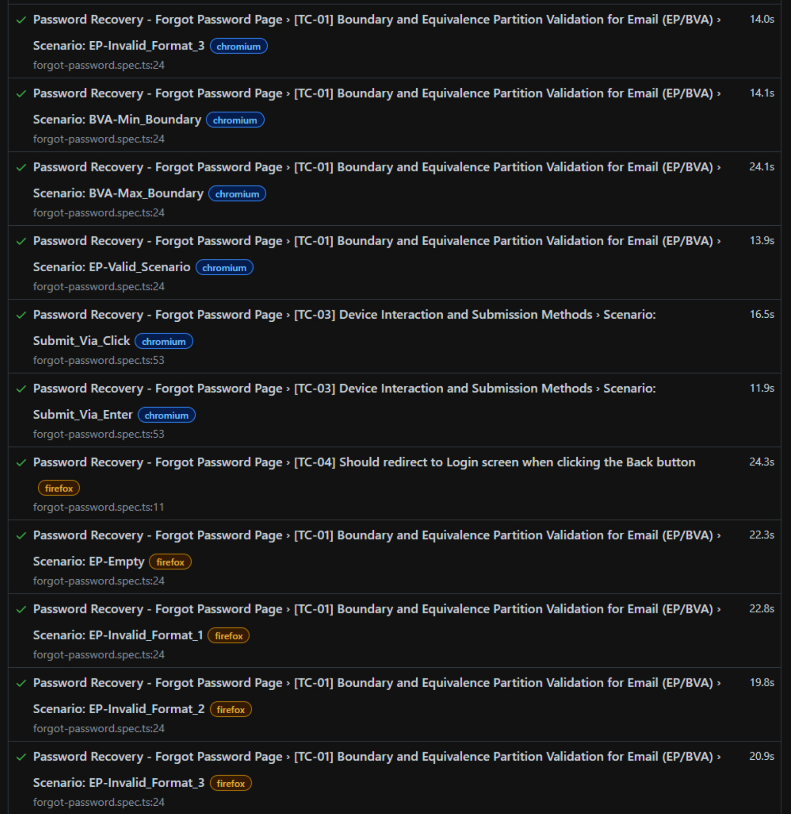
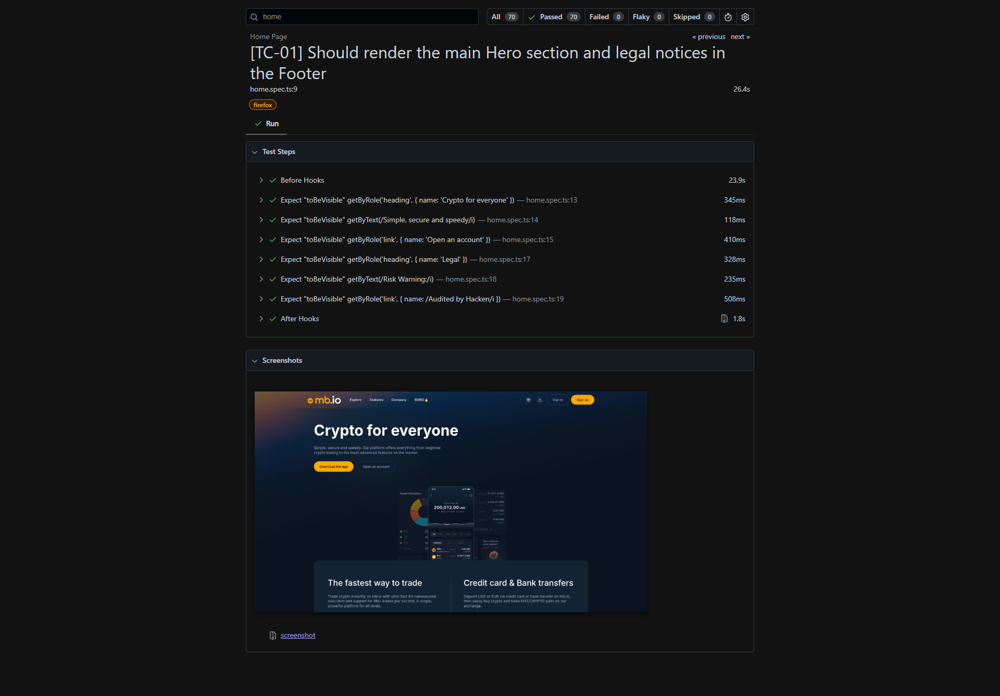
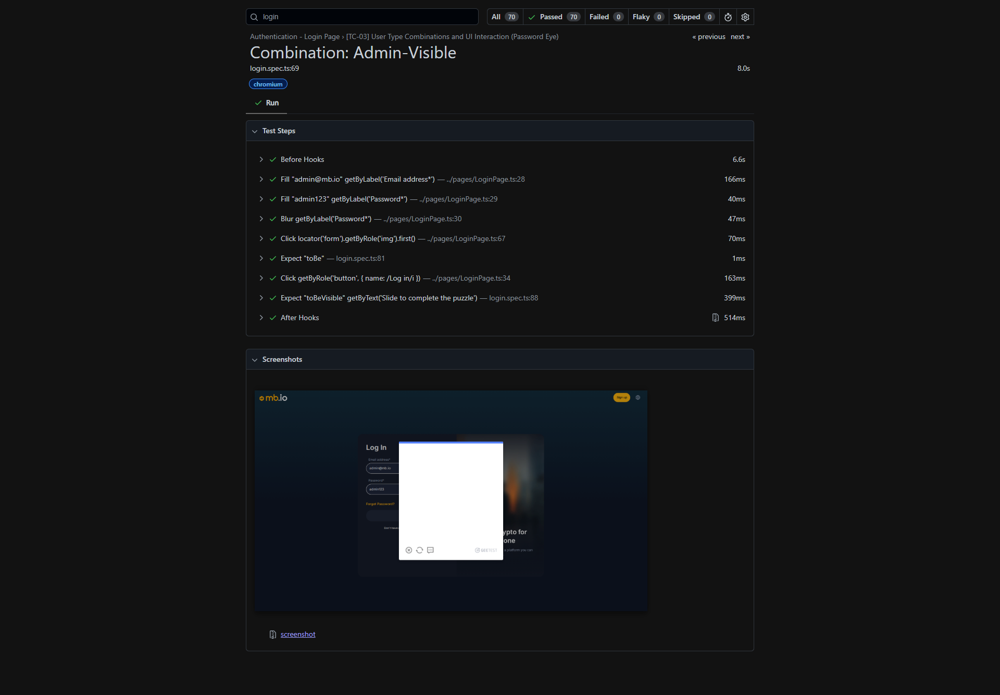

# E2E Test Automation — MultiBank Group Technical Challenge


End-to-end test automation suite built for the **MultiBank Group QA Challenge**, covering the trading platform ([trade.multibank.io](https://trade.multibank.io)) and the institutional website ([mb.io](https://mb.io/en)). The project is written in **TypeScript** using **Playwright**, following the **Page Object Model** pattern extended with **Dependency Injection via Fixtures**, and applies industry-standard testing techniques such as **Equivalence Partitioning**, **Boundary Value Analysis**, **Pairwise Testing**, and **Data-Driven Testing**.

> 📊 **Live E2E Test Report:** Click here to view the latest execution dashboard hosted on GitHub Pages!  
> 👉 **[View Playwright HTML Report](https://jcfbernardo.github.io/playwright_coding_challenge/)**

*Note: The report is automatically generated and deployed by GitHub Actions after every push to the main branch.*

---

## Prerequisites

| Requirement | Version |
|---|---|
| Node.js | ≥ 18.x |
| npm | ≥ 9.x |
| Playwright browsers | installed via CLI (see below) |

---

## Installation & Execution

### 1. Clone the repository

```bash
git clone https://github.com/jcfbernardo/playwright_coding_challenge.git
cd playwright_coding_challenge
```

### 2. Install dependencies

```bash
npm install
```

### 3. Install Playwright browsers

```bash
npx playwright install --with-deps
```

### 4. Run all tests (headless)

```bash
npx playwright test
# or
npm test
```

### 5. Run tests with interactive UI

```bash
npx playwright test --ui
# or
npm run test:ui
```

### 6. Run on a single browser

```bash
npm run test:chromium
```

### 7. Generate and open the HTML report

```bash
npx playwright show-report
```

### 8. Generate and open the Allure report

```bash
npm run report
```

---

## Test Scope

### Authentication (`trade.multibank.io`)

| Spec | Coverage |
|---|---|
| `login.spec.ts` | TC-01 EP/BVA field validation · TC-02 visual render · TC-03 password eye toggle · TC-04 navigation links |
| `register.spec.ts` | TC-01 format/boundary/required field validation · TC-03 password toggle + pairwise submission · TC-04 navigation link |
| `forgot-password.spec.ts` | TC-01 email EP/BVA · TC-03 submission via click/enter · TC-04 back navigation |

### Navigation & Layout (`mb.io/en`)

| Spec | Coverage |
|---|---|
| `home.spec.ts` | TC-01 Hero + Footer render · TC-02 market showcase (lazy loading) · TC-03 auth route href validation · TC-04 top nav links · TC-05 footer download link |
| `why-multibank.spec.ts` | TC-01 Hero + business metrics · TC-02 institutional copy sections · TC-03 Strength cards + Community section |

---

## Project Architecture

```
playwright_coding_challenge/
├── tests/
│   ├── e2e/                   # Test specs (one file per page/flow)
│   │   ├── login.spec.ts
│   │   ├── register.spec.ts
│   │   ├── forgot-password.spec.ts
│   │   ├── home.spec.ts
│   │   └── why-multibank.spec.ts
│   ├── pages/                 # Page Object Model classes
│   │   ├── base/
│   │   │   └── BasePage.ts    # Abstract base with goto() and waitForLoad()
│   │   ├── LoginPage.ts
│   │   ├── RegisterPage.ts
│   │   ├── ForgotPasswordPage.ts
│   │   ├── HomePage.ts
│   │   └── WhyMultiBankPage.ts
│   ├── fixtures/
│   │   └── index.ts           # Playwright fixture extension (DI layer)
│   └── data/                  # External test data (DDT)
│       ├── loginData.ts
│       ├── registerData.ts
│       └── forgotPasswordData.ts
├── scripts/
│   └── Task2_StringFrequency.ts
├── .github/
│   └── workflows/
│       └── playwright.yml     # GitHub Actions CI pipeline
├── playwright.config.ts
└── package.json
```

### Why Fixtures?

Playwright's `test.extend<Pages>()` pattern acts as a **lightweight dependency injection container**. Each page object is instantiated once per test and injected automatically — no manual `new LoginPage(page)` calls in specs, no shared state between tests, and seamless parallel execution without worker conflicts.

```typescript
// fixtures/index.ts
export const test = base.extend<Pages>({
  loginPage: async ({ page }, use) => {
    await use(new LoginPage(page));
  },
  // ...
});

// login.spec.ts — page object arrives ready, no setup needed
test('TC-02', async ({ loginPage }) => {
  const { heading, logo } = await loginPage.getUIElements();
  await expect(heading).toBeVisible();
});
```

---

## Technical Decisions & Engineering Trade-offs

### 1. CAPTCHA / WAF Security Boundary

The application uses a **GeeTest slide puzzle** before any authentication attempt reaches the back-end. The happy-path tests (e.g., `EP-Valid_Scenario` in TC-01 and all TC-03 scenarios) therefore validate up to and including the **rendering of the CAPTCHA element** — intentionally stopping there.

This decision avoids:
- Circumventing the WAF / bot-detection layer of a **live production environment**
- Creating ghost accounts or polluting the database
- Legal/ethical concerns with automated bypasses

```typescript
const captcha = await loginPage.getCaptchaElement();
await expect(captcha).toBeVisible({ timeout: 10_000 });
// ✅ Asserts security mechanism is active — does not solve it
```

### 2. Lazy Loading & Progressive Scroll

The market data tables on the Home page render asynchronously and are hidden until they enter the viewport. Instead of fixed `waitForTimeout` calls, the suite uses:

- `page.keyboard.press('PageDown')` — triggers the browser's native scroll event, which fires lazy-load listeners
- `element.scrollIntoViewIfNeeded()` — Playwright's built-in viewport coercion, retried automatically

```typescript
await page.keyboard.press('PageDown');
await market.sectionTitle.scrollIntoViewIfNeeded();
await expect(market.sectionTitle).toBeVisible();
```

### 3. Link Validation via DOM Assertions (No Real Navigation)

The Home Page TC-03 validates that Sign In / Sign Up buttons route to the correct URLs using **`toHaveAttribute('href', regex)`** instead of clicking and navigating.

Benefits:
- **No network round-trip** → zero flakiness from redirects or load time variance
- **No cross-origin navigation** → avoids Playwright context resets
- Keeps the test **deterministic and fast**

```typescript
await expect(homePage.btnSignIn).toHaveAttribute('href', /.*login.*/i);
await expect(hero.btnOpenAccount).toHaveAttribute('href', /.*(?:register|signup).*/i);
```

### 4. Known Bug Documentation

Where a confirmed UI defect exists, the suite marks it explicitly using `test.fail()` rather than skipping or removing the case:

```typescript
if (data.knownBug) {
  test.fail(true, 'Front-End BUG: Max length validation fails in UI.');
}
```

This keeps the test in the execution matrix, documents the regression risk, and surfaces the failure in every report run.

---

### Test Execution Reports & Cross-Browser Testing

This project ensures cross-browser compatibility by executing the E2E suite against **Chromium and Firefox**. 

Playwright's native HTML reporter captures screenshots automatically at the end of every test to demonstrate successful runs.

### Cross-Browser Execution Dashboard


### Successful Run Screenshots



## CI/CD

The project ships with a **GitHub Actions** workflow (`playwright.yml`) that runs on every push and pull request to `main` and `master`. It features an advanced pipeline tailored for performance and accessibility:

- **Parallel Execution (Sharding):** The test suite is split into 3 concurrent shards (`shard: [1/3, 2/3, 3/3]`) to significantly reduce execution time.
- **Unified Reporting:** Merges individual blob reports from all shards into a single, cohesive HTML report.
- **Artifact Storage:** Uploads the unified HTML report as a downloadable artifact (15-day retention).
- **GitHub Pages Deployment:** Automatically deploys the final HTML report to GitHub Pages upon successful merges to the `main` or `master` branches.

```yaml
# .github/workflows/playwright.yml
on:
  push:
    branches: [ main, master ]
  pull_request:
    branches: [ main, master ]
```

---

## Author

**João Carlos F. Bernardo**
[GitHub](https://github.com/jcfbernardo) · [LinkedIn](https://www.linkedin.com/in/jo%C3%A3o-carlos-fernandes-487782260/)
